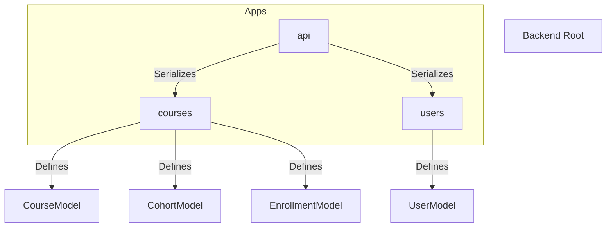
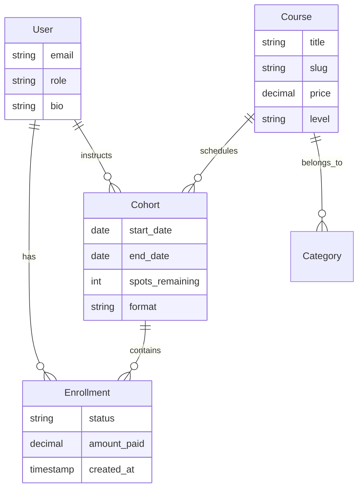
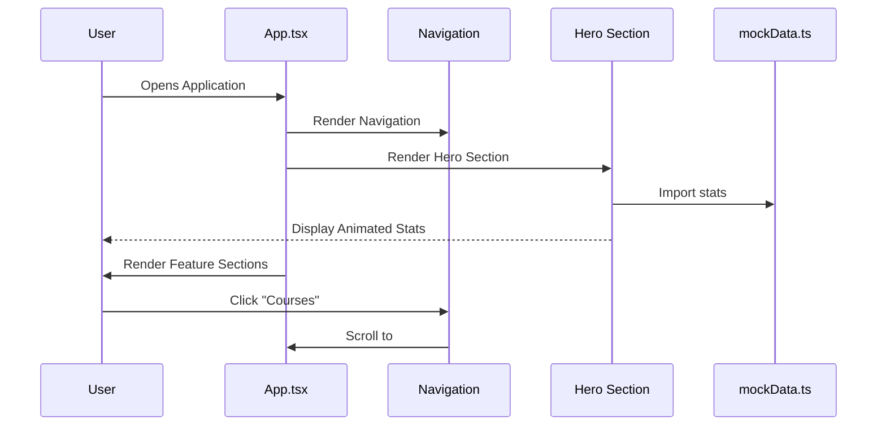
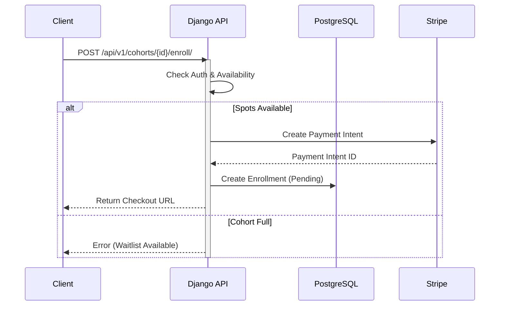

# AI Academy - Project Architecture Document

## 1. Executive Summary

**AI Academy** is a production-grade educational platform designed for AI and Software Engineering training. It is architected as a decoupled full-stack application consisting of a **React (Vite)** frontend and a **Django (DRF)** backend.

### Core Design Philosophy
The project follows a **"Precision Futurism"** aesthetic, emphasizing:
- **Technologic Minimalism:** High-contrast, code-first aesthetics (JetBrains Mono, Space Grotesk).
- **CSS-First Styling:** utilizing Tailwind CSS with extensive CSS variables for theming.
- **Component-Driven UI:** Leveraging Shadcn/UI primitives for accessible, composable interfaces.

> **⚠️ Architecture Note:** While the `README.md` references Next.js, the actual codebase is currently implemented as a **Vite + React Single Page Application (SPA)**. This document reflects the actual implementation found in the codebase. The frontend currently utilizes **mock data** for UI rendering, while the backend is fully structured to serve real data via REST APIs.

---

## 2. High-Level System Architecture

The system follows a classic **Client-Server** architecture.

```mermaid
graph TD
    User[User / Browser]
    
    subgraph Frontend [Frontend (Vite + React)]
        SPA[Single Page App]
        Router[Client Router]
        Zustand[State Management]
        UI[Shadcn UI Components]
    end
    
    subgraph Backend [Backend (Django)]
        API[Django REST Framework]
        Auth[JWT Authentication]
        Admin[Django Admin]
        
        subgraph Services
            CoursesApp[Courses App]
            UsersApp[Users App]
            EnrollmentApp[Enrollment App]
        end
    end
    
    subgraph Infrastructure
        DB[(PostgreSQL)]
        Redis[(Redis Cache)]
        Stripe[Stripe Payment Gateway]
    end

    User -->|HTTPS| SPA
    SPA -->|Mock Data / API Calls| API
    API -->|Read/Write| DB
    API -->|Cache| Redis
    API -->|Payments| Stripe
```

---

## 3. Frontend Architecture

The frontend is built with **React 19** using **Vite** for tooling. It emphasizes a strict separation between presentation (Sections) and primitives (UI Components).

### 3.1 Directory Structure

```mermaid
graph TD
    src[src]
    src --> components[components]
    src --> sections[sections]
    src --> data[data]
    src --> lib[lib]
    src --> hooks[hooks]
    
    components --> layout[layout]
    components --> ui[ui (Shadcn)]
    
    layout --> Nav[Navigation.tsx]
    layout --> Foot[Footer.tsx]
    
    ui --> Button[Button.tsx]
    ui --> Card[Card.tsx]
    
    sections --> Hero[Hero.tsx]
    sections --> Features[Features.tsx]
    
    data --> Mock[mockData.ts]
```

### 3.2 Key Technologies
| Technology | Version | Purpose |
|------------|---------|---------|
| **Vite** | 7.2.4 | Build tool and dev server. Replaces Next.js in this implementation. |
| **React** | 19.2.0 | UI Library. |
| **Tailwind CSS** | 3.4.19 | Styling engine. Configured with a CSS-variable based theme (`index.css`). |
| **Framer Motion** | 12.35.0 | Complex animations (staggered entrances, scroll reveals). |
| **Lucide React** | 0.562.0 | Iconography. |
| **Shadcn/UI** | - | Re-usable component primitives (Radix UI wrappers). |

### 3.3 Design System Implementation
The design system is centralized in `src/index.css` via CSS variables, enabling dynamic theming.

**Key Theme Variables:**
- **Primary:** `Electric Indigo` (`#4f46e5`) - Used for primary actions and branding.
- **Secondary:** `Neural Cyan` (`#06b6d4`) - Used for AI/ML accents.
- **Typography:**
    - Display: `Space Grotesk`
    - Body: `Inter`
    - Code: `JetBrains Mono`

### 3.4 Data Flow (Current State)
Currently, the frontend components import data directly from `src/data/mockData.ts`.

```typescript
// Example: src/sections/FeaturedCourse.tsx
import { courses } from "@/data/mockData";

export function FeaturedCourse() {
  const featuredCourse = courses[0]; 
  // ... renders UI based on mock object
}
```

---

## 4. Backend Architecture

The backend is a robust **Django 6.0.2** application exposing a REST API. It is structured into modular applications.

### 4.1 Module Hierarchy



### 4.2 Application Modules

#### 1. `users` App
Handles user authentication and profiles.
- Extends `AbstractUser`.
- Roles: `is_student`, `is_instructor`.
- Metadata: `bio`, `company`, `linkedin_url`.

#### 2. `courses` App
The core domain logic.
- **Course:** Educational content (Title, Slug, Pricing, Level).
- **Cohort:** Scheduled instances of a course (Dates, Format, Capacity).
- **Enrollment:** Link between `User` and `Cohort` (Payment Status).

#### 3. `api` App
The interface layer using Django REST Framework (DRF).
- **Views:** `CourseViewSet`, `CohortViewSet`.
- **Serializers:** Transforms Models to JSON.
- **Routers:** Auto-generates URL configs (`/api/v1/courses/`).

### 4.3 Data Model Diagram (ERD)



---

## 5. Key Interactions & Workflows

### 5.1 Landing Page Rendering (User View)
This workflow represents the current "Hybrid" state where the frontend uses mock data but mimics the structure of the backend data models.



### 5.2 Enrollment Flow (Backend Design)
This outlines the intended architecture once frontend/backend integration is complete.



---

## 6. Project Configuration & Tooling

### 6.1 Configuration Files
- **`frontend/vite.config.ts`**: Configures the build pipeline, resolves aliases (`@/*` to `src/*`).
- **`frontend/tailwind.config.js`**: Defines the Design System tokens (Colors, Spacing, Animations).
- **`backend/academy/settings/*.py`**: Split settings strategy:
    - `base.py`: Common config (Apps, Middleware).
    - `development.py`: Local debug settings.
    - `production.py`: Security hardening, DB config via env vars.

### 6.2 Environment Variables
| Variable | Scope | Purpose |
|----------|-------|---------|
| `NEXT_PUBLIC_API_URL` | Frontend | Base URL for Backend API (e.g. `localhost:8000/api/v1`). |
| `SECRET_KEY` | Backend | Django cryptographic signing key. |
| `DATABASE_URL` | Backend | PostgreSQL connection string. |
| `REDIS_URL` | Backend | Cache and Celery broker connection. |
| `STRIPE_SECRET_KEY` | Backend | API key for processing payments. |

---

## 7. Developer Handbook

### Adding a New UI Component
1. Run shadcn command (if applicable) or create `src/components/ui/MyComponent.tsx`.
2. Ensure it accepts `className` for overriding styles via `cn()`.
3. Export from the file.

### Adding a New API Endpoint
1. Define the **Model** in `backend/courses/models.py`.
2. Create a **Serializer** in `backend/api/serializers.py`.
3. Create a **ViewSet** in `backend/api/views.py`.
4. Register the ViewSet in `backend/api/urls.py`.

### Migration to Production
To move from the current Mock Data state to Full Stack:
1. Replace `import { courses } from "@/data/mockData"` with `fetch('/api/v1/courses/')`.
2. Use `useEffect` or React Query to handle loading/error states in React components.
3. Ensure CORS is configured in `backend/academy/settings/base.py` to allow the frontend domain.
