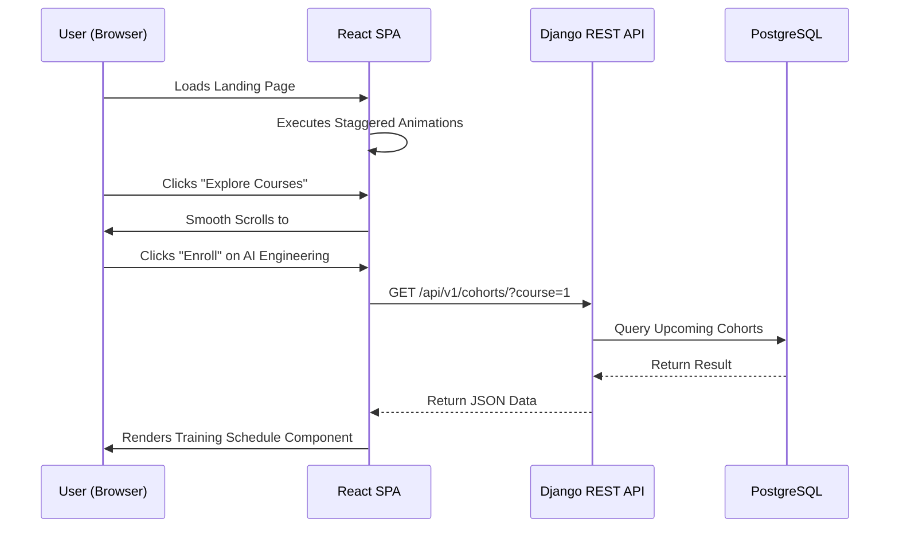
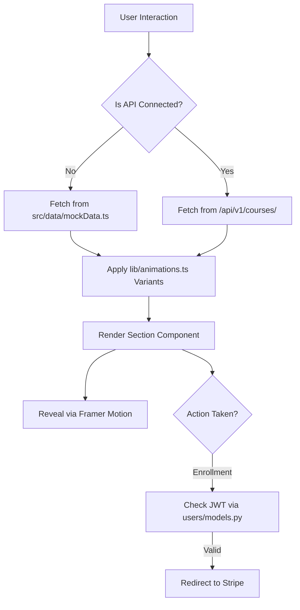

# AI Academy: Production-Grade Training Platform

[](https://react.dev/)
[](https://www.djangoproject.com/)
[](https://tailwindcss.com/)
[](https://www.w3.org/WAI/standards-guidelines/wcag/)

**AI Academy** is an elite, full-stack educational platform built for the next generation of AI Engineers. It features a decoupled architecture using a high-performance **Vite + React SPA** and a robust **Django REST API**, all wrapped in a distinctive **"Precision Futurism"** design language.

---

## 🎨 Design Philosophy
### *Precision Futurism with Technologic Minimalism*
We reject "AI Slop"—the generic purple gradients and soft bento grids that dominate modern templates. Instead, we embrace:
- **High-Contrast Authority:** A clean Ivory/Indigo/Cyan palette.
- **Developer-First Aesthetics:** Monospace accents and terminal-inspired UI elements.
- **Architectural Edges:** A strict `0rem` border radius for a sharp, structural feel.
- **Intentional Motion:** Purposeful, staggered animations that guide the eye without distraction.

---

## 🏗 Application Architecture

The project is architected as a strictly decoupled system to ensure scalability and independent deployment cycles.

### File Hierarchy
```text
/
├── frontend/               # React 19 + Vite 7 SPA
│   ├── src/
│   │   ├── sections/       # High-level page modules (Hero, Features, etc.)
│   │   ├── components/
│   │   │   ├── layout/     # Global shell (Navigation, Footer)
│   │   │   └── ui/         # Atomic Shadcn/Radix primitives
│   │   ├── lib/
│   │   │   ├── animations.ts # Centralized Framer Motion constants
│   │   │   └── utils.ts    # Merging logic (cn)
│   │   └── data/           # Mock data layer for hybrid phase
│   └── index.css           # Design System & CSS Variables
├── backend/                # Django 6.0.2 REST API
│   ├── academy/            # Project core & split settings
│   ├── api/                # DRF layer (Serializers & ViewSets)
│   ├── courses/            # Domain logic (Course, Cohort, Enrollment models)
│   └── users/              # Auth logic & Custom User profiles
└── GEMINI.md               # SSoT for AI coding agents
```

### Key Files Description
- **`frontend/src/index.css`**: The heart of the design system. Contains all CSS variables for the 60-30-10 color rule.
- **`frontend/src/lib/animations.ts`**: Standardizes all transition durations and easings across the app.
- **`backend/courses/models.py`**: Defines the complex relationship between Courses, scheduled Cohorts, and User Enrollments.
- **`backend/api/serializers.py`**: Ensures type-safe data transmission between Django and React.

---

## 🔄 Interaction & Logic Flows

### User Interaction Journey
This diagram illustrates the path from discovery to enrollment.



### Application Logic Flow
The following flowchart describes the internal data-handling logic during the "Hybrid Phase".



---

## 🚀 Getting Started

### 1. Backend Setup
```bash
cd backend
python -m venv venv
source venv/bin/activate
pip install -r requirements/base.txt
python manage.py migrate
python manage.py runserver
```

### 2. Frontend Setup
```bash
cd frontend
npm install
npm run dev
```

---

## 🌐 Deployment Strategy

### Frontend (Edge)
- **Target:** Vercel or Netlify.
- **Workflow:** Automatic deployment on `git push main`.
- **Environment:** Production build using `vite build`.

### Backend (Cloud)
- **Target:** Dockerized container on DigitalOcean or AWS.
- **Database:** Managed PostgreSQL 16.
- **Storage:** AWS S3 for course thumbnails and user avatars.
- **Task Queue:** Celery + Redis for asynchronous enrollment emails.

---

## ♿ Accessibility & Performance
- **Target:** **WCAG AAA** Compliance.
- **Reduced Motion:** All animations check `prefers-reduced-motion` via the `useReducedMotion` hook.
- **Color Contrast:** All Indigo/Cyan combinations are verified for a 7:1 contrast ratio.
- **Lighthouse Goals:** 95+ Performance, 100 Accessibility.

---

## 🛡 License
This project is licensed under the MIT License. Developed with precision by the AI Academy Team.
