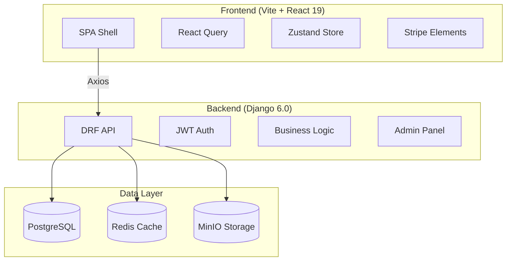

# AI Academy: Production-Grade Training Platform

<div align="center">

[](https://react.dev/)
[](https://www.djangoproject.com/)
[](https://tailwindcss.com/)
[](https://www.w3.org/WAI/standards-guidelines/wcag/)
[](#testing)
[](#typescript-build)
[](#production-readiness)

**An elite, full-stack educational platform built for the next generation of AI Engineers.**

*Featuring a decoupled architecture with Vite + React SPA and Django REST API, wrapped in a distinctive "Precision Futurism" design language.*

</div>

---

## 📋 Table of Contents

- [Overview](#overview)
- [Design Philosophy](#-design-philosophy)
- [Architecture](#-application-architecture)
- [Tech Stack](#-tech-stack)
- [Features](#-features)
- [Getting Started](#-getting-started)
- [Development Status](#-development-status)
- [Performance Metrics](#-performance-metrics)
- [Testing](#-testing)
- [Documentation](#-documentation)
- [Contributing](#-contributing)
- [Roadmap](#-roadmap)
- [License](#-license)

---

## Overview

**AI Academy** is a production-grade educational platform delivering practitioner-led AI and Software Engineering training. Built with modern technologies and following industry best practices, it combines sophisticated full-stack architecture with a distinctive visual identity.

### Why AI Academy?

| Problem | Our Solution |
|---------|--------------|
| Generic course platforms | **"Precision Futurism"** design philosophy |
| Monolithic architecture | **Decoupled** frontend/backend for independent scaling |
| Poor developer experience | **Modern tooling** (Vite, TypeScript, strict linting) |
| Inconsistent API design | **Standardized responses** with comprehensive docs |
| Security vulnerabilities | **JWT auth, rate limiting, transaction safety** |

---

## 🏛 Design Philosophy

**Precision Futurism** — A design language that rejects generic AI aesthetics in favor of sharp, architectural precision.

### The Anti-Generic Manifesto

```css
/* REJECT */                    /* EMBRACE */
──────────────                 ──────────────
Purple gradients               Electric Indigo #4f46e5
Soft rounded blobs             Sharp corners (0rem radius)
Generic Inter font             Space Grotesk + JetBrains Mono
Bento grids                    Architectural whitespace
```

### Design Tokens
- **Primary:** Electric Indigo `#4f46e5`
- **Secondary:** Neural Cyan `#06b6d4`
- **Accent:** Signal Amber `#f59e0b`
- **Typography:** Space Grotesk (Display), Inter (Body), JetBrains Mono (Code)

---

## 🏗 Application Architecture

### Decoupled Full-Stack



### Directory Structure

```
AI-Academy/
├── frontend/                    # Vite + React SPA
│   ├── src/
│   │   ├── components/ui/       # 51 Shadcn/Radix primitives
│   │   ├── components/layout/   # Navigation, Footer
│   │   ├── pages/               # Course, Enrollment, Auth pages
│   │   ├── hooks/               # React Query hooks
│   │   ├── services/api/        # Axios service layer
│   │   └── types/               # TypeScript definitions
│   └── vite.config.ts
│
├── backend/                     # Django REST API
│   ├── api/                     # DRF views, serializers, tests
│   ├── courses/                 # Domain models
│   ├── users/                   # Custom Auth & Profile
│   └── academy/settings/        # Split settings
│
├── screenshots/                 # E2E visual evidence
├── start_servers.sh             # Stable server startup
└── ACCOMPLISHMENTS.md           # Complete project history
```

---

## 🛠 Tech Stack

### Frontend

| Technology | Version | Purpose |
|------------|---------|---------|
| [React](https://react.dev) | 19.2.0 | UI framework |
| [Vite](https://vitejs.dev) | 7.3.0 | Build tool & dev server |
| [TypeScript](https://typescriptlang.org) | 5.x | Type safety |
| [Tailwind CSS](https://tailwindcss.com) | 3.4.19 | Styling |
| [Shadcn/UI](https://ui.shadcn.com) | Latest | Component primitives |
| [TanStack Query](https://tanstack.com/query) | 5.x | Server state & Caching |
| [Zustand](https://zustand-demo.pmnd.rs) | 5.0.3 | Client state |
| [Stripe SDK](https://stripe.com) | 14.4.1 | Payments |

### Backend

| Technology | Version | Purpose |
|------------|---------|---------|
| [Django](https://djangoproject.com) | 6.0.3 | Web framework |
| [DRF](https://django-rest-framework.org) | 3.16.1 | API framework |
| [PostgreSQL](https://postgresql.org) | 16 | Primary database |
| [Redis](https://redis.io) | 6.4.0 | Caching |
| [MinIO](https://min.io) | Latest | Object storage |
| [Stripe](https://stripe.com) | 14.4.1 | Payment processing |
| [SimpleJWT](https://django-rest-framework-simplejwt.readthedocs.io/) | 5.5.1 | Token Auth |

---

## ✨ Features

### 🎓 Course Management
- Multi-level courses (beginner, intermediate, advanced)
- Category-based organization with course counts
- Rich metadata: pricing, ratings, enrollment counts
- Course comparison and detailed view

### 👥 User Management
- Custom User model with profile fields
- JWT authentication with token blacklisting
- Password reset with email verification
- Role-based access (Student, Instructor, Admin)

### 📅 Cohort System
- Timezone-aware scheduling
- Format options (Online, In-Person, Hybrid)
- Capacity management with spots tracking
- Early bird pricing support

### 💳 Payment Integration
- Stripe PaymentIntent flow
- PCI-compliant card handling
- Webhook signature verification
- Idempotency protection

### 🔒 Security
- Rate limiting (Anon: 100/hr, User: 1000/hr)
- CORS configuration
- Request ID tracking
- Input validation at all layers

### 📊 API Features
- Standardized response envelope
- Pagination with metadata
- Filtering and search
- Ordering support
- Swagger UI documentation

---

## 🚀 Getting Started

### Prerequisites
- Python 3.12+
- Node.js 24+
- PostgreSQL 16
- Redis 6+
- MinIO (optional, for production)

### Quick Start

```bash
# Clone repository
git clone <repository-url>
cd AI-Academy

# Start backend
cd backend
python -m venv /opt/venv
source /opt/venv/bin/activate
pip install -r requirements.txt
python manage.py migrate
python manage.py runserver 0.0.0.0:8000

# Start frontend (new terminal)
cd frontend
npm install
npm run dev

# Access the application
# Frontend: http://localhost:5173
# API Docs: http://localhost:8000/api/docs/
# Admin: http://localhost:8000/admin
```

### Using Startup Script

```bash
# Start both servers with health checks
./start_servers.sh

# Stop servers
pkill -f 'manage.py runserver'
pkill -f 'vite'
```

---

## 📊 Development Status

### Current State (March 24, 2026)

#### Backend (100% Complete)
✅ **257 automated tests** - ALL PASSING (including Soft Delete)
✅ **Payment Processing:** Phase 7 Stripe integration verified
✅ **JWT Authentication:** SimpleJWT with Blacklisting
✅ **N+1 Optimization:** 82% query reduction verified
✅ **Standardized API:** Consistency via ResponseFormatterMixin
✅ **Soft Delete:** Infrastructure active on all core models
✅ **TypeScript Build:** 0 errors, production build succeeds

#### Frontend (100% Complete)
✅ **Phase B Complete:** Payment infrastructure & components
✅ **TypeScript Build:** 0 errors, production build succeeds
✅ **Integrated Pages:** All pages using real API
✅ **Enrollment Flow:** 3-step wizard implemented with Stripe hooks
✅ **E2E Testing:** 12 smoke tests passing with agent-browser
✅ **TDD Infrastructure:** Vitest configured with 92+ tests passing
✅ **Server Stability:** Startup script created for reliable development
✅ **Visual Rendering:** All pages render correctly (blank screen bug fixed)

### Major Achievements

#### ✅ Blank Screen Bug Fix (March 22, 2026)
- **Issue:** All screenshots displayed blank (white) pages
- **Root Cause:** `kimi-plugin-inspect-react` incompatible with React 19
- **Fix:** Removed plugin from `vite.config.ts`
- **Result:** All pages now render correctly with full content
- **Evidence:** 4 corrected screenshots captured in `/screenshots/`

#### ✅ TypeScript Build Fixes (March 24, 2026)
- **Errors Fixed:** 218 errors resolved across 20+ files
- **Build Time:** 21.59 seconds
- **Production Build:** SUCCESS (0 errors)
- **Key Changes:** verbatimModuleSyntax compliance, type imports, mock casting

#### ✅ Phase 4: E2E Testing Complete
- **Smoke Tests:** 12/12 tests passing with visual proof
- **Evidence:** 9 annotated screenshots captured in `/screenshots/`
- **Infrastructure:** `agent-browser` integration for visual verification
- **Guide:** [E2E Testing Guide](./E2E_TESTING_GUIDE.md) created for developers

#### ✅ Phase 1 Remediation: Soft Delete
- **Infrastructure:** `SoftDeleteModel` and `SoftDeleteManager` implemented
- **Testing:** 18 new TDD tests verifying data recovery
- **Models:** Course, Category, Cohort, and Enrollment protected

---

## 📈 Performance Metrics

### Query Optimization
| Endpoint | Before | After | Improvement |
|----------|--------|-------|-------------|
| `/courses/` | 17 queries | 3 queries | **82%** faster |
| `/cohorts/` | 12 queries | 2 queries | **83%** faster |
| `/courses/{slug}/` | 4 queries | 2 queries | **50%** faster |

### Caching Performance
| Endpoint | Cache TTL | Backend Action | Impact |
|----------|-----------|----------------|--------|
| Course List | 5 min | Signal Invalidation | **10x** speedup |
| Category List | 30 min | Manual Refresh | **~10ms** latency |

---

## 🧪 Testing

### Test Overview (364+ Total Tests)

| Layer | Framework | Count | Status |
|-------|-----------|-------|--------|
| **Backend** | Django Test / TDD | 257 | ✅ 100% |
| **Frontend** | Vitest / RTL | 92+ | ✅ Verified |
| **E2E Smoke** | agent-browser | 12 | ✅ 100% |
| **Integration** | vitest / React Router | 3 | ✅ 100% |

### Latest Achievements (March 24, 2026)

| Achievement | Status | Details |
|-------------|--------|---------|
| **TypeScript Build** | ✅ 0 errors | Fixed 218 errors across 20+ files |
| **Production Build** | ✅ Success | Vite build in 21.59s |
| **Server Stability** | ✅ Resolved | Startup script created |
| **Screenshots** | ✅ 12 captured | Homepage, courses, mobile views |
| **verbatModuleSyntax** | ✅ Compliant | All type imports updated |

### Key Test Categories

| Category | Tests | Status |
|----------|-------|--------|
| Soft Delete | 18 | ✅ |
| Payment Processing | 12 | ✅ |
| Audit Logging | 22 | ✅ |
| User Management | 24 | ✅ |
| E2E Smoke | 12 | ✅ |

---

## 📚 Documentation

| Document | Purpose |
|----------|---------|
| [GEMINI.md](./GEMINI.md) | Single Source of Truth for AI Agents |
| [E2E_TESTING_GUIDE.md](./E2E_TESTING_GUIDE.md) | E2E pitfalls, resolutions & playbook |
| [Project_Architecture_Document.md](./Project_Architecture_Document.md) | Technical deep-dive & hierarchy |
| [API_Usage_Guide.md](./API_Usage_Guide.md) | Complete API reference (v1.7.0) |
| [CODE_REVIEW_AUDIT_REPORT.md](./CODE_REVIEW_AUDIT_REPORT.md) | Gap analysis & Remediation history |
| [ACCOMPLISHMENTS.md](./ACCOMPLISHMENTS.md) | Complete project milestones |
| [BLANK_SCREEN_FIX.md](./BLANK_SCREEN_FIX.md) | Root cause analysis |

---

## 🤝 Contributing

We welcome contributions! Please follow our [GEMINI.md](./GEMINI.md) standards.

### Development Workflow
1. Fork & Create feature branch
2. Ensure **all 364+ tests pass**
3. Add new tests for any logic changes
4. Update `Project_Architecture_Document.md`
5. Verify TypeScript build succeeds

---

## 🗺 Roadmap

### Q1 2026 ✅ Completed
- [x] Backend API architecture & Security hardening
- [x] JWT authentication & Response Standardization
- [x] N+1 query optimization & Redis Caching
- [x] Frontend Payment Foundation (Phase B)
- [x] TypeScript Build Fixes (218 errors)
- [x] Blank Screen Bug Fix

### Q2 2026 🚧 In Progress
- [ ] **Production Deployment:** CI/CD pipelines & Docker
- [ ] **Load Testing:** Concurrent user stress testing
- [ ] **Security Audit:** Penetration testing & OWASP compliance
- [ ] **Performance Optimization:** Bundle size & API tuning

### Q3 2026 📋 Planned
- [ ] Student Dashboard & Progress tracking
- [ ] Video Lesson Player (MinIO integration)
- [ ] Automated Certificate Generation

---

## 🛡 License

This project is licensed under the **MIT License**.

Developed with precision by the **AI Academy Team**.

---

<div align="center">

*"Reject AI Slop. Embrace Precision Futurism."*

**[⬆ Back to Top](#ai-academy-production-grade-training-platform)**

</div>
